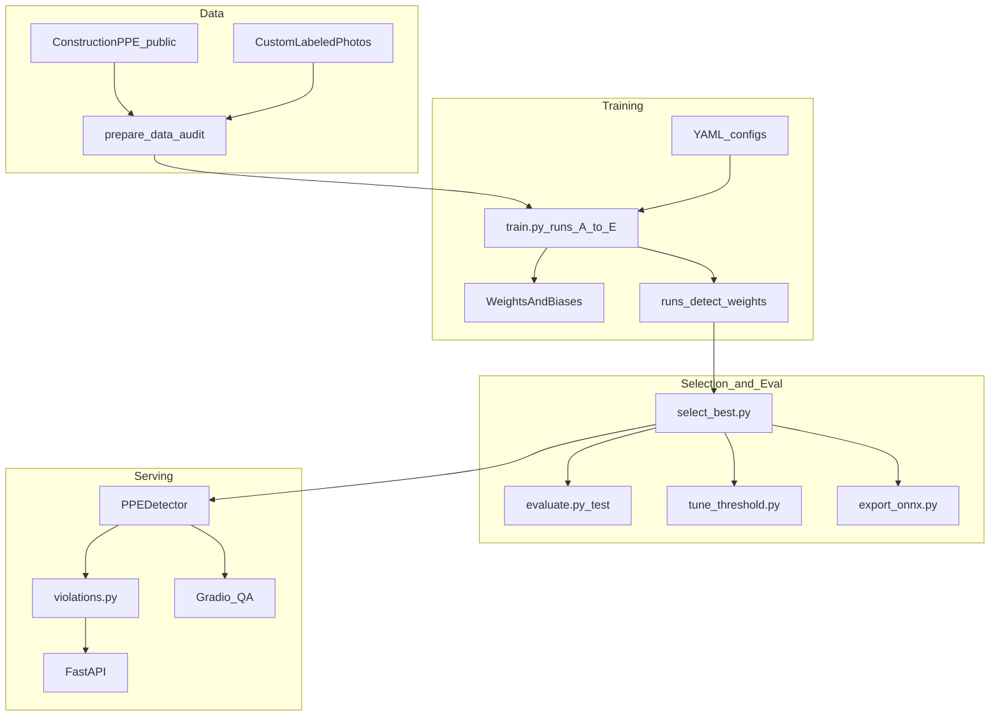
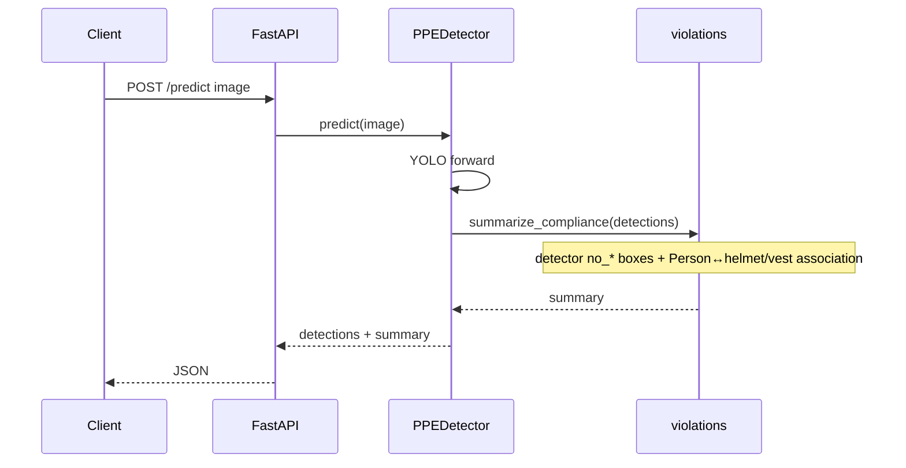

# Architecture

## Goal

Detect PPE on construction-site images, map detections to **compliance violations**, and expose a stable inference API that can be retrained when new labeled site data arrives.

## Component diagram



## Design decisions

| Decision | Choice | Why |
|---|---|---|
| Detector | Ultralytics YOLO11 | Strong detection baseline, native MPS, simple train/export |
| Device | Apple MPS | Target machine is M3 Max; no cloud GPU required |
| Tracking | W&B | Multi-run comparison is first-class for real projects |
| Configs | One YAML per run | One knob change per experiment; reproducible |
| Split discipline | Official train/val/test | No leakage from reshuffling; comparable results |
| Business output | Violation codes + association rules | Clients need “missing helmet”, not raw class ids; association covers weak `no_*` detectors |
| Deploy artifact | ONNX (+ `.pt`) | Portable; TensorRT skipped (NVIDIA-only) |

## Training flow

1. `prepare_data.py` downloads data, checks split overlap, class balance, writes `experiments/data_manifest.json`.
2. `optimize_data.py` oversamples rare violation classes on **train only** → `configs/data_optimized.yaml`.
3. `train.py --config configs/train_*.yaml` runs experiments A–D (E after custom ingest; optional F after `merge_hardhat.py`).
4. `select_best.py` ranks by **val** mAP50-95, copies winner to `weights/best.pt`, updates `configs/infer.yaml`.
5. `evaluate.py` runs **once** on the test split.
6. `tune_threshold.py` sweeps confidence on **val**, writes `conf` into `infer.yaml`.

Current selected run: **`more_epochs`** (see `experiments/best_run.json`).

## Inference flow



`src/violations.py` emits:

- **Detector** findings from `no_helmet` / `no_goggle` / `no_gloves` / `no_boots`
- **Association** findings when a `Person` box has no associated `helmet` or `vest` nearby (`missing_helmet`, `missing_vest`)

## API contract

### `GET /health`

```json
{
  "status": "ok",
  "model_loaded": true,
  "device": "mps",
  "conf": 0.25
}
```

### `POST /predict`

Multipart form field `file` (image).

```json
{
  "filename": "site.jpg",
  "detections": [
    {
      "class_id": 7,
      "class_name": "no_helmet",
      "confidence": 0.87,
      "bbox": [x1, y1, x2, y2]
    }
  ],
  "summary": {
    "compliant": false,
    "person_count": 1,
    "worn_ppe": ["vest"],
    "violation_codes": ["missing_helmet"],
    "violations": []
  },
  "model": "weights/best.pt",
  "conf": 0.25,
  "device": "mps"
}
```

## Repository map

```text
configs/     train + infer YAMLs
scripts/     prepare / optimize / merge_hardhat / train / select / evaluate / tune / export / ingest
src/         inference + violation + association rules (library)
app/         FastAPI + Gradio
tests/       unit + API smoke
experiments/ manifests, metrics, best_run.json
docs/        architecture, cards, runbook
```

## Extending to a client site

1. Collect site images.
2. Label with the same 11-class schema ([LABELING_GUIDE.md](LABELING_GUIDE.md)).
3. `make ingest-custom` (or point `configs/data.yaml` at the new dataset).
4. Rerun `train-all` → `select` → `eval` → `tune` → `export`.
5. Point `configs/infer.yaml` at the new `best.pt` and restart the API.
